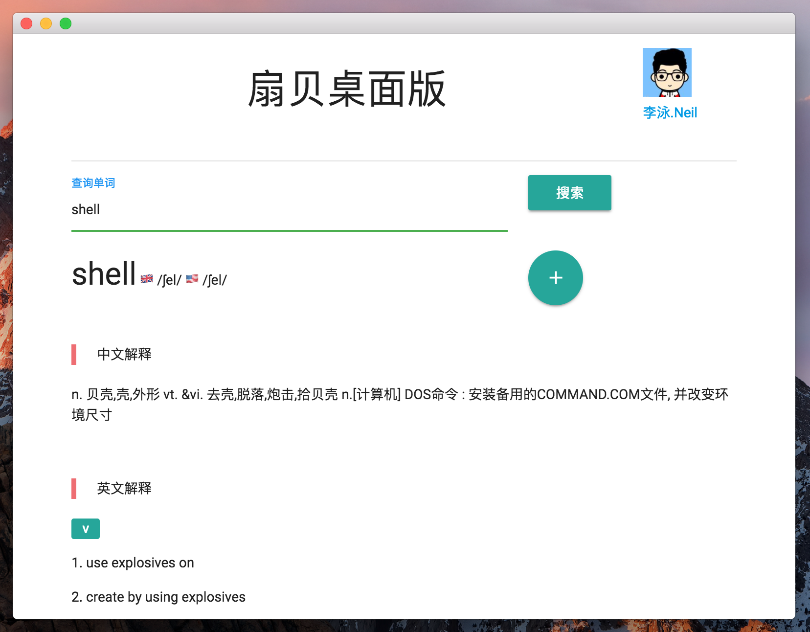

  

# 扇贝桌面版 🐚 
学习使用 Electron 和 Vue.js 的练习项目 🎉。利用扇贝 API 开发的跨平台桌面应用 💻。

目前可以实现基本查词功能 📖。

系统托盘可以实现弹出窗口快速查词。

## 开发计划
- [] 实现 OAuth 2.0 授权，增加「添加生词本」的功能。

## Credit

Icons made by <a href="http://www.freepik.com" title="Freepik">Freepik</a> from <a href="https://www.flaticon.com/" title="Flaticon">www.flaticon.com</a> is licensed by <a href="http://creativecommons.org/licenses/by/3.0/" title="Creative Commons BY 3.0" target="_blank">CC 3.0 BY</a>
